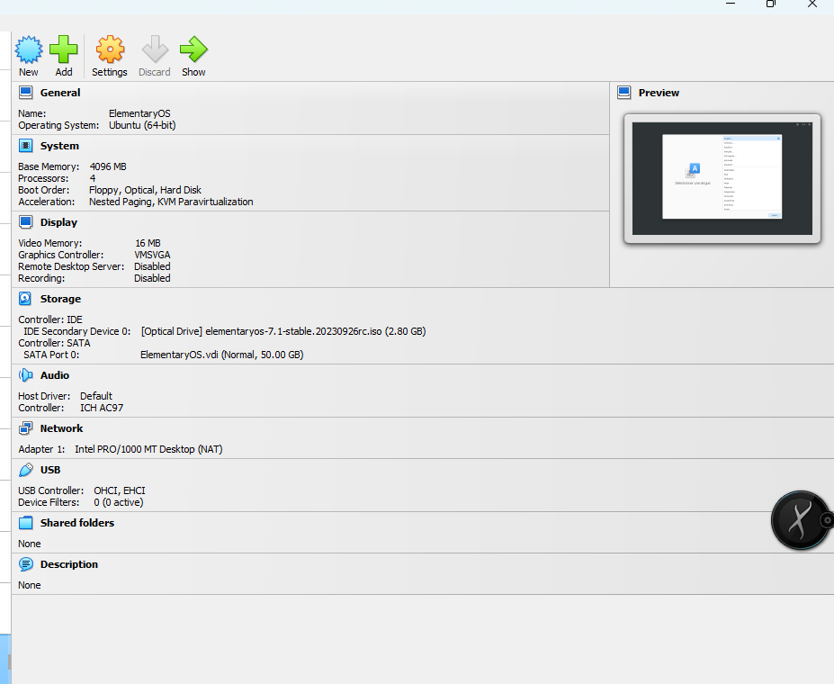
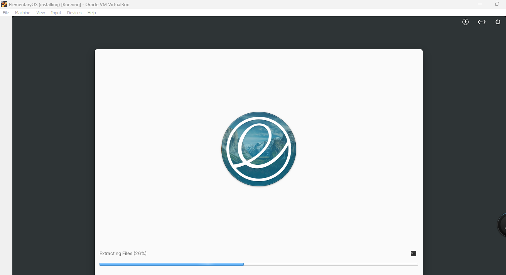
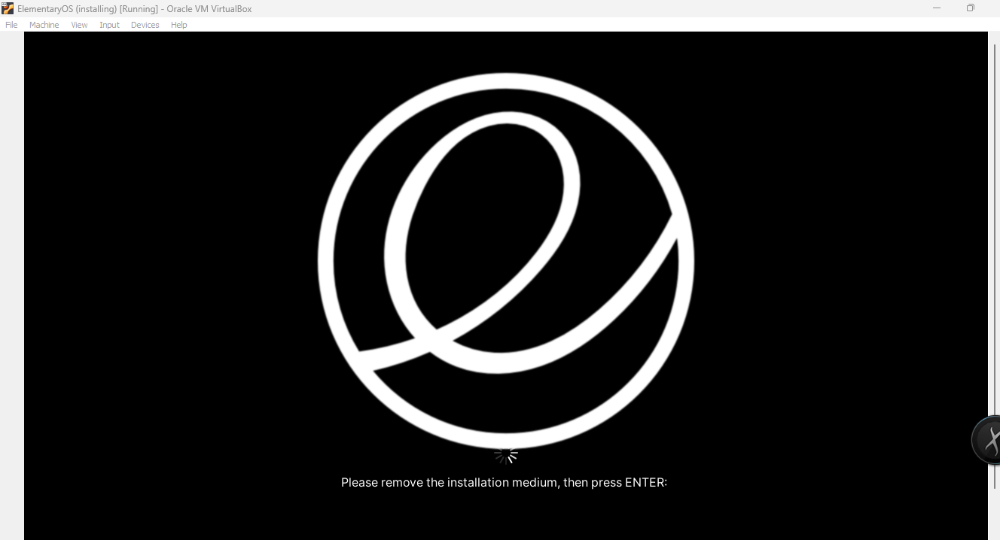
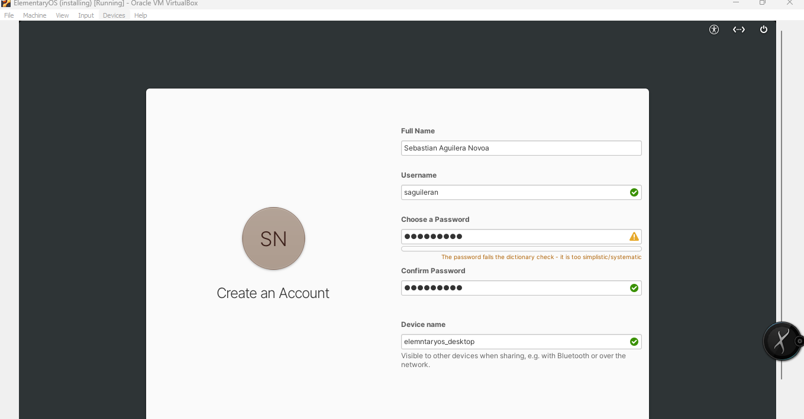

# ElementaryOS  7.1
---

Description

## Objetivos

### General

- Install ElementaryOS 7.1 on a VirtualBox with the following the correct requirements.

### Complementary

- Set up the OS
- Update the OS
- Install an application on the OS

## Requirements

The last version of ElementaryOS require the following:

- Procesador reciente, Intel i3 o equiparable, de dos núcleos y de 64 bits
- 4 GB de memoria del sistema (RAM)
- Solid state drive (SSD) with at least 32 GB of free space
- Acceso a Internet
- Built-in or wired mouse/touchpad and keyboard
- 1024×768 minimum resolution display

## Pasos

#### 1. Download the OS

To download the OS go to the link [https://elementary.io/es/](https://elementary.io/es/).

#### 2. Set up the VM

  

#### 3. Installing OS

  

#### 4. Finishing the OS Installation

  

The user created is `saguileran` with password **123456789**.

  

#### 5. Testing and Evaluating the OS

Update
Install an application or videogame

[enlace al repositorio](https://github.com/saguileran/OperatingSystems) 

## Conclusion

The OS is pretty but very slow, there is not much documentation.
